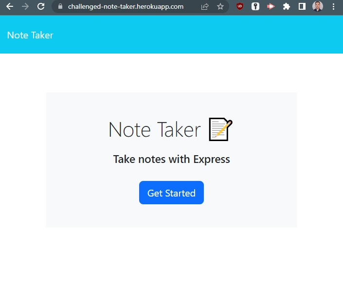
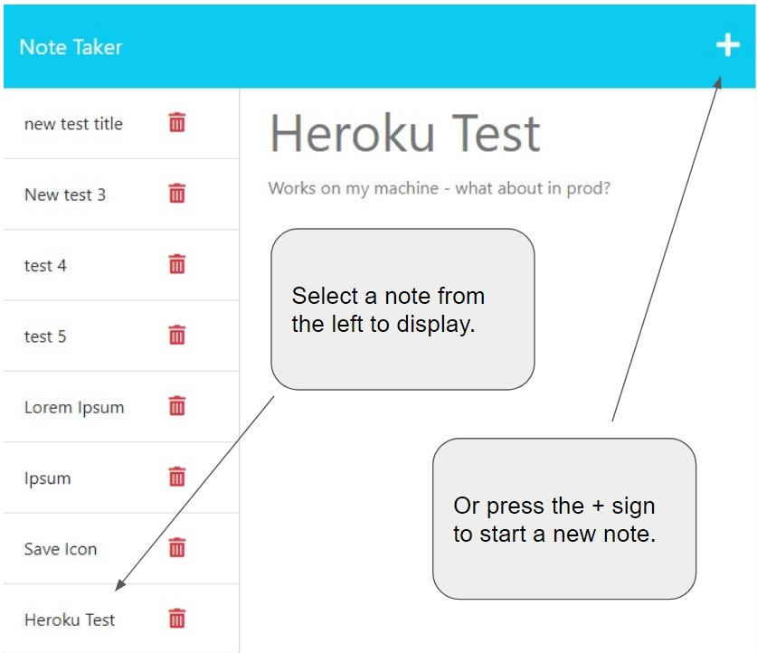
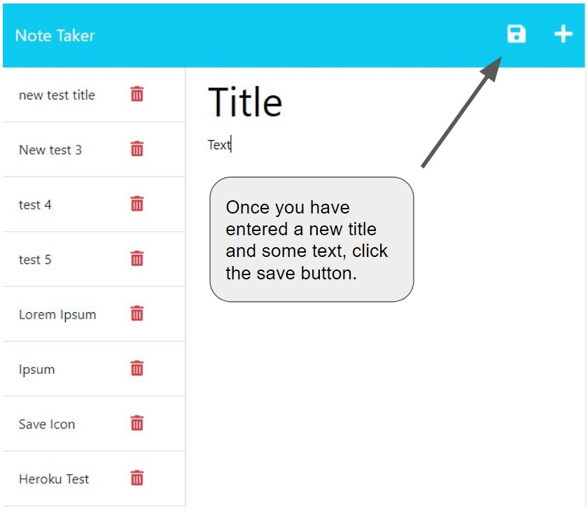

# c11-express-note-taker
This is challenge 11 for the UT Coding Bootcamp: Express.js Note Taker.

## Description

This project is a Note Taker app built using Express.js and deployed to Heroku in order to better understand how to build out the back end, connect it to the provided front end, and get it all working in a production environment.

Primary lessons learned were that scope still matters and that punctuation can be sneaky.
  

## Table of Contents

- [Installation](#installation)
- [Usage](#usage)
- [Credits](#credits)
- [License](#license)

## Installation

The app is deployed here: https://challenged-note-taker.herokuapp.com/

## Usage

Once you are on the landing page, click "Get Started"

 

On the Notes screen, you can click an existing note on the left to display it, or create a new note.

 

Once you have entered both a TITLE and TEXT for a new note, click the save button.

## Credits

Full-Stack Blog - [Professional README Guide](https://coding-boot-camp.github.io/full-stack/github/professional-readme-guide)

Starter Code - https://github.com/coding-boot-camp/miniature-eureka 

UT Coding Boot Camp - Module 11 _(class repo is private)_
- https://github.com/the-Coding-Boot-Camp-at-UT

## License

Please see LICENSE file.

---
